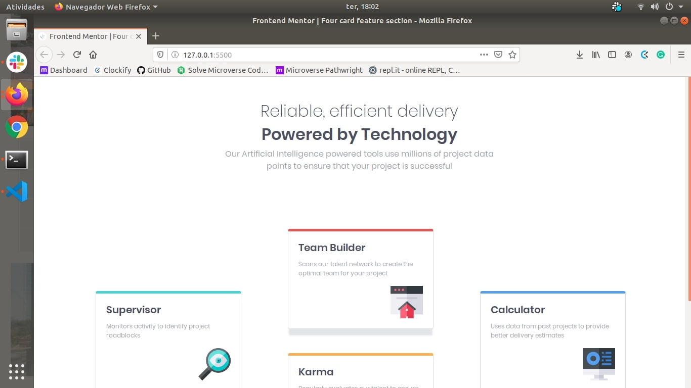
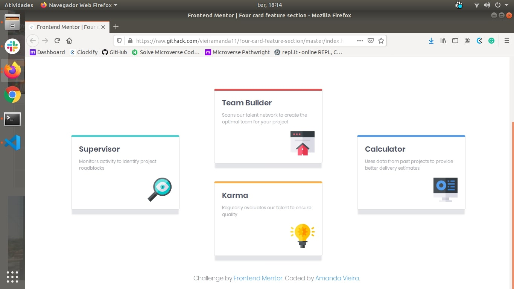

# Frontend Mentor - Four card feature section

## Welcome! 👋

[Frontend Mentor](https://www.frontendmentor.io) challenges allow you to improve your skills in a real-life workflow. Skills applied to this project: 
  * HTML
  * CSS
  * Bootstrap

## Live Version

[Click here](https://vieiramanda11.github.io/four-card-feature-section/.)

# Screenshots

## Screenshot 1

## Screenshot 2

## Design Preview

